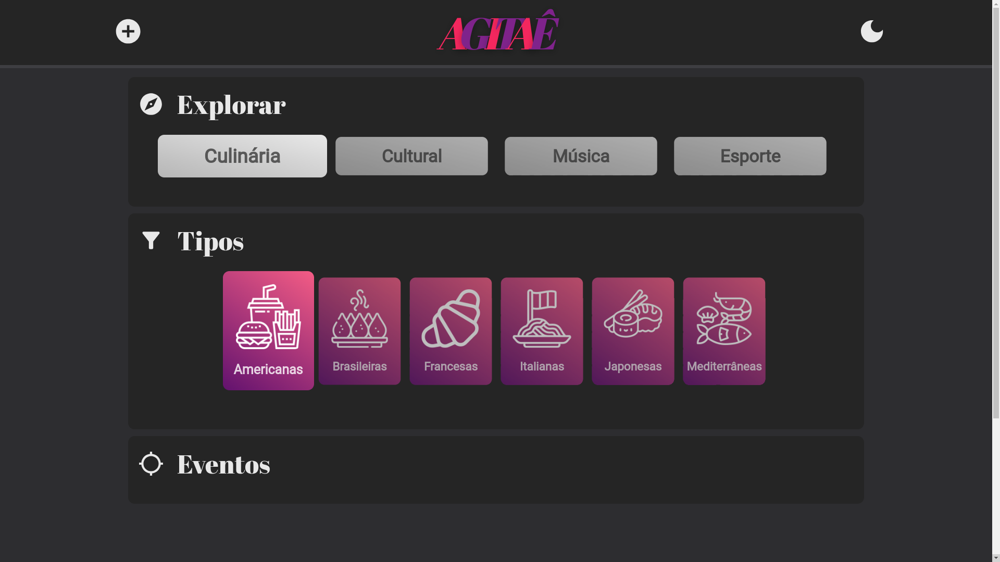

# Agitaê Frontend - Lucas Lima
[Link do repositório do backend](https://github.com/lucasouzamil/agitae-backend)


## Descrição do Projeto
[Vídeo de descrição do projeto](https://www.youtube.com/watch?v=rIQygQGKxb0&t=0s)

Este é um projeto desenvolvido em React por Lucas Lima com o objetivo de colocar em prática conhecimentos relacionados a bancos de dados e APIs. O intuito do site é servir como uma plataforma onde as pessoas podem publicar eventos e pesquisar por eles, mantendo-se informadas sobre festivais, jogos esportivos, workshops, entre outros.

**A ideia do site é creditada aos alunos da FGV:** Isabela Ingracia, Isabella Perez, Nicolas Marinho, Lucas Calixto e Pedro Lima.



## Funcionalidades

A aplicação teve o foco em duas principais funcionalidades:

1. Publicar eventos em um [banco de dados](https://github.com/lucasouzamil/agitae-backend) baseado em Django REST framework.

2. Puxar de uma API externa informações climáticas sobre o local do evento.


## Requisitos e execução

Para executar a aplicação, siga os seguintes passos:

1. Certifique-se de que você possui o Python, NodeJS e Django instalado em seu computador.
2. Clone o repositório do backend:
   ```bash
   git clone https://github.com/lucasouzamil/agitae-backend
3. Navegue para o diretório do backend:

   ```bash
   cd agitae-backend
4. Inicie o ambiente virtual:
    ```bash
    // Windows PowerShell
    env\Scripts\Activate.ps1

    // Windows Prompt de Comando
    env\Scripts\activate.bat

    // Linux/MacOS
    source env/bin/activate
5. Inicie o banco de dados:
    ```bash
    python3 manage.py runserver
6. Clone o repositório do frontend:
   ```bash
   git clone https://github.com/lucasouzamil/agitae-frontend
7. Navegue para o diretório do frontend:
   ```bash
   cd agitae-frontend/agitae-app
8. Inicie a aplicação:
   ```bash
   npm start
9. Acesse o link http://localhost:3000/ no seu navegador de preferência.

## Tecnologias Utilizadas
* **React**: para desenvolver o frontend.
* **Django**: para desenvolver o backend.
* **API's externas**: [Geoapify](https://www.geoapify.com/) para converter endereçõs em coordenadas. [Openweathermap](https://openweathermap.org/) para converter coordenadas em informações climáticas.

## Funcionalidades adicionais
* **Dark Mode**: o site possui dark mode e light mode.
* **Form check**: ao publicar o evento, há uma checagem no formulário para fazer com que o banco de dados seja povoado de maneira adequada e sem spam.
* **Responsividade**: o site é responsivo e é possível acessálo por aparelhos móveis sem problemas.
* **Imagem no banco de dados**: o banco de dados armazena imagens.

## Autor
* Nome: Lucas Lima
* Email: lucasfsl@al.insper.edu.br

## Licença
Este projeto está sob a Licença MIT. Você é livre para modificar e distribuir o código de acordo com os termos desta licença.